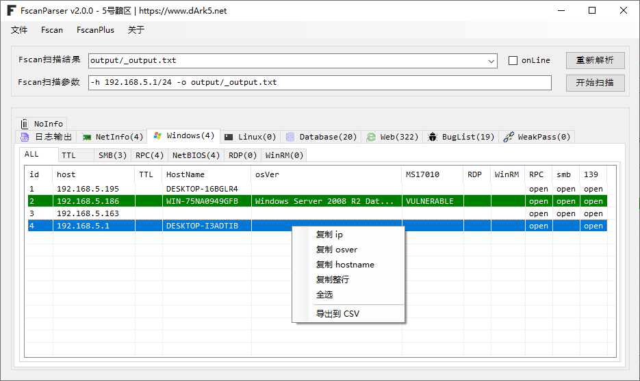
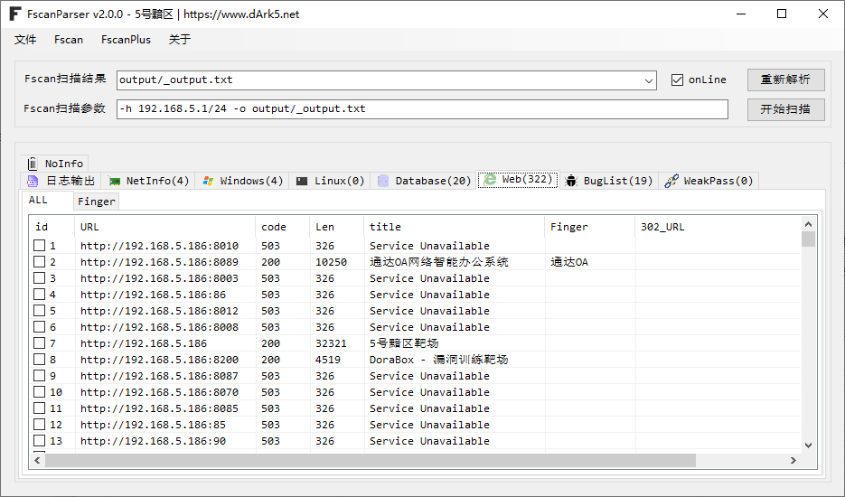
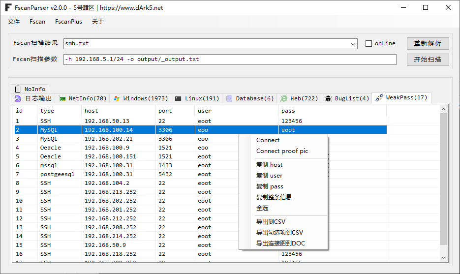

# FscanParser
 一个用于处理fsacn输出结果的小工具（尤其面对大量资产的fscan扫描结果做输出优化，让你打点快人五步！！！）

## 工具界面

### 日志输出

处理过后的结果内容

### Windows

显示Windows的机器信息

## Web

显示的是Web相关信息

## BugList

显示存在漏洞的信息

## WeakPass

显示弱口令信息，支持连接、执行命令、自动截图留存整证明、自动连接并截图导出到docx等

