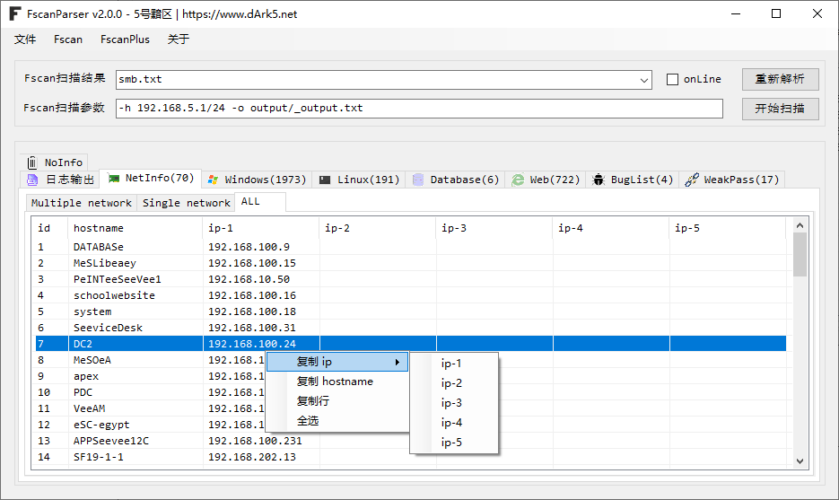

# FscanParser
 一个用于处理fsacn输出结果的图形化工具（尤其面对大量资产的fscan扫描结果做输出优化，让你打点快人五步！！！）

## 版本支持
目前支持最新版本fscan(**1.8.4**)及[FscanPlus](https://github.com/teamdArk5/FscanPlus)的扫描结果：`fscan.exe -h 192.168.5.1/24 -o outputlocal.txt`

旧版fscan结果与新版稍有不同，会影响展示结果，请尽量使用新版。

让我们致敬Fscan！！！

## 视频教程

https://www.bilibili.com/video/BV1STpgetEYr/

## 工具界面

### 日志输出

处理过后的结果内容

### NetInfo

显示基于网卡数量信息，如为多网卡的机器我们就优先渗透。

### Windows

显示Windows的机器信息

### Web

显示的是Web相关信息

### BugList

显示存在漏洞的信息

### WeakPass

显示弱口令信息，支持连接、执行命令、自动截图留存整证明、自动连接并截图导出到docx等

​	直接连接弱口令，无需再打开其他的连接工具。

​	导出弱口令连接证明图到doc

## 更新
* 2024年11月17日 v2.1
  * 修复Windows显示版本信息不全的bug。
  
* 2024年10月23日 v2.0
  * 更新直接在界面调用Fscan扫描并填充结果文件路径。

* 2024年10月21日 v1.3.7
  * 修复Oracle和postgreSQL结果交叉显示bug

* 2024年9月12日	v1.3.6
  * 修复Web选项卡重复URL报错Bug

* 2024年9月11日 v1.3.5
  * 修复Smb选项卡对结果展示不完整的Bug

* 2024年9月4日 v1.3.4
  * 修复Web右键菜单中选项卡的Bug

* 2024年9月1日 v1.3.3
  * 修复Database选项卡数据显示bug

* 2024年8月29日 v1.3.1
  * 增加NetInfo标签页的右键菜单

  * 增加部分菜单全选功能

* 2024年8月29日 v1.3
  * 修复程序解析Bug

* 2024年8月24日 v1.2
  * 新增文本框拖拽获取路径功能。
  * 新增Linux选项卡的右键菜单。
  * 新增Web选项卡的awvs导出，支持直接导出到awvs扫描的csv
* 2024年8月23日 v1.1
  * 增加数据库右键菜单
  * 增加网卡（多）信息显示
  * 增加网段无信息端口选项卡显示

## Start Cheet

 